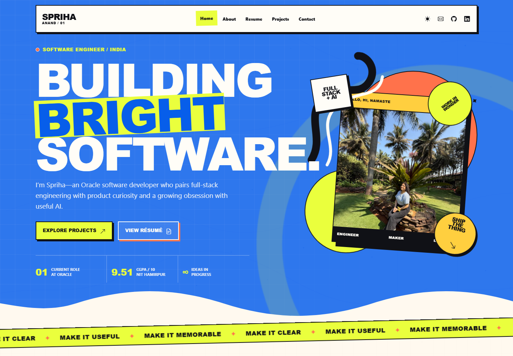
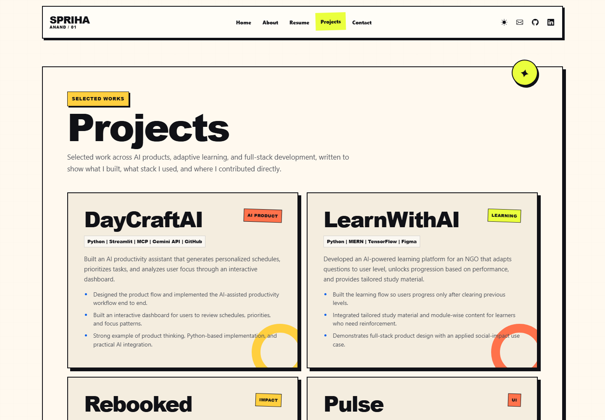
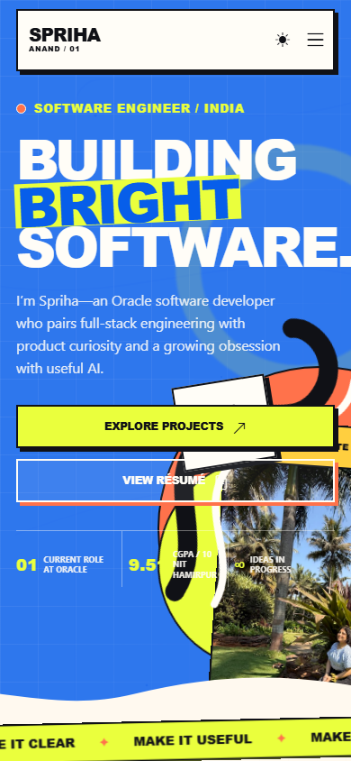

# Spriha Anand — Portfolio

A bold, playful personal portfolio for **Spriha Anand**, an Associate Software Developer at Oracle and a full-stack engineer interested in thoughtful product experiences and practical AI.

The current visual system is an original “electric playground”: poster-scale typography, cobalt blue, lime, coral, playful hard-shadow details, and gentle animated swells that bring motion to the page without getting in the way of the work.

## Highlights

- Responsive, multi-page portfolio covering **About**, **Resume**, **Projects**, and **Contact**
- High-energy home page with animated swells, illustrated stickers, and project storytelling
- Desktop and mobile navigation with clear active states
- Dark-mode toggle with the preference saved locally
- Motion that respects <code>prefers-reduced-motion</code>
- Accessible interaction details including visible focus states, labelled navigation, and decorative motion kept out of the reading flow
- No build tool or package installation required

## Screenshots

### Home / Desktop

### Projects / Desktop

### Home / Mobile

## Featured work

| Project | Focus | Stack |
| --- | --- | --- |
| **DayCraftAI** | AI productivity assistant for personalized schedules, priorities, and focus patterns | Python, Streamlit, MCP, Gemini API, GitHub |
| **LearnWithAI** | Adaptive learning platform that tailors questions and study material to the learner | Python, MERN, TensorFlow, Figma |
| **Rebooked** | Platform for buying, selling, and donating used books to local NGOs | MERN, Kotlin, Firebase, Google API, ML |
| **Pulse** | Responsive frontend experience built with contemporary UI patterns | HTML, CSS, Tailwind CSS, JavaScript |

## Run locally

This is a static site. From the project root, start any simple local server:

~~~powershell
py -m http.server 4173
~~~

Then visit [http://localhost:4173](http://localhost:4173).

To stop the server, return to the terminal and press <kbd>Ctrl</kbd>+<kbd>C</kbd>.

## Project structure

~~~text
.
├── index.html                 # Home page
├── about.html                 # Profile and background
├── resume.html                # Experience, skills, and résumé PDF
├── services.html              # Selected projects
├── contact.html               # Contact details
└── assets/
    ├── css/style.css           # Shared visual system and responsive styles
    ├── js/main.js              # Theme, navigation, scroll, and motion behavior
    ├── img/                    # Portrait and supporting visual assets
    └── screenshots/            # README previews of the current site
~~~

## Technology

- HTML5
- CSS3
- Vanilla JavaScript
- Bootstrap and Bootstrap Icons
- AOS for entrance transitions

## Contact

- Email: [sprihaanand@gmail.com](mailto:sprihaanand@gmail.com)
- GitHub: [SprihaAnand](https://github.com/SprihaAnand)
- LinkedIn: [Spriha Anand](https://www.linkedin.com/in/spriha-anand-818672227/)
